# 硬件准备

## B91 蓝牙低功耗音频套件

## 硬件介绍

----------------------------------------------------------------------------------------------
类别            芯片料号    开发板外部名称             个数     配套附件              
--------------- ---------- ------------------------  -------- -------------------------------- 
CIS TWS         9517C      B91 音频开发板             2        Mini USB 数据线 2根,           
															   天线 2个

CIS模拟手机端    9518A      B91 开发板                 1        USB线 1根,
															    天线 1个            
     
BIS sink        9517C      B91 音频开发板             1         USB线 1根,
																天线 1个
																
BIS source      9518A      B91 适配器                  2                             

BIS assistant   9218A      B91 音频遥控器              1                       
																				           
----------------------------------------------------------------------------------------------

Table: 配套开发板一览表

**Note:**

>- 可以通过淘宝购买该套件，如果还未上架，请联系 Telink FAE 购买 B91 蓝牙低功耗音频套件. 

## 硬件设计参考
- [Telink wiki](http://wiki.telink-semi.cn/wiki/chip-series/TLSR951x-Series/) 页面下 Development Kit and Application Boards 章节

# 软件准备
- [下载工具](http://wiki.telink-semi.cn/wiki/IDE-and-Tools/Burning-and-Debugging-Tools-for-all-Series/)
- SDK：N/A
- [BIN](http://192.168.48.36/sdk_app/demo-research/le_audio_demo) (此链接为 telink 内部链接，客户需要联系 FAE 获取）

# Unicast Audio Demo (CIS Demo)
## Unicast Audio
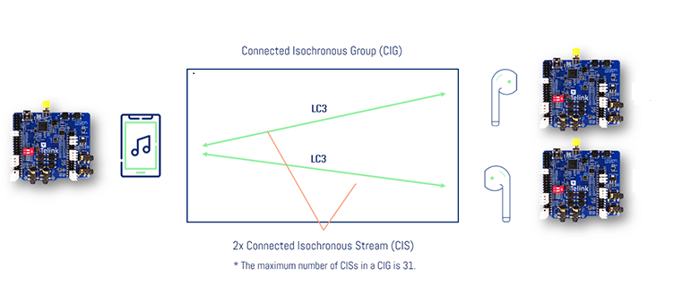

## 模式选择

### USB 模式

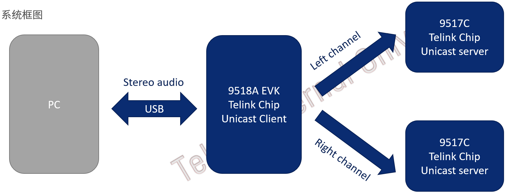

USB模式 – 双声道音频数据由PC端通过USB有线传送给Unicast client，然后Unicast Client使用LC3算法分别将左右声道音频数据压缩后通过BLE协议无线传输给两个Unicast Server，Unicast Server收到数据解压缩后通过板载Line-out通路将音频数据在本地播放。

### Line-in模式

Line-in模式 – Unicast Client通过Line-in通路采集PC或Phone端的双声道音频数据，然后通过LC3算法分别将左右声道数据压缩并通过BLE协议无线传输给两个Unicast Server,Unicast Server收到音频数据后解压缩并在本地通过板载Line-out通路播放。

## 上层profile协议

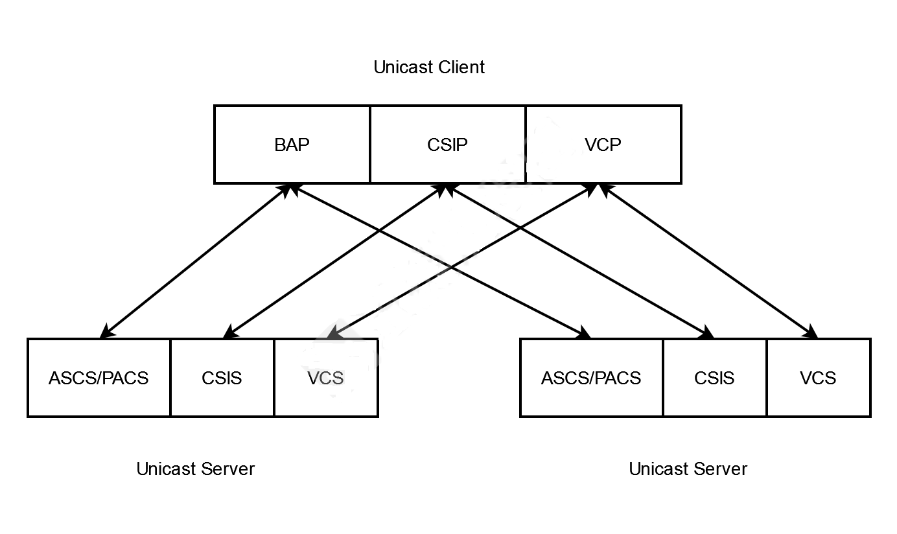

**BAP**

BAP规定了标准音频流的建立流程，Unicast Client和Unicast Server之间可以通过BAP层的协议交互建立起双方都支持的音频通路。Unicast Audio Demo音频建立流程使用了标准BAP协议，其音频建立流程符合最新的BAP规范。

**CSIP**

CSIP协议规定了如何将一个设备识别为协调集的一部分。Unicast Client可以通过CSIP发现所有协调集的成员。Unicast Audio demo使用标准CSIP协议，Unicast Client只要连接到一个Unicast Server，就能主动发现并连接与之相关的另一个Unicast Server(协调集成员)，而不用采用地址过滤之类的方法。

**VCP**

VCP协议规定了标准的音量控制行为，通过VCP协议，Unicast Client 能够同步调节多个Unicast server端的音量。 Unicast Audio demo通过使用VCP协议，Unicast Client可以同步控制两个Unicast Server的音量以及mute/unmute。

## 主要功能

**立体声**

Unicast Client通过对USB模式或者line-in模式传入的立体声音频进行解析，将立体声音频数据分为左右声道，通过BLE标准协议分别传给两个Unicast Server。两个Unicast Server将接收的音频数据在本地播放，就能实现双声道立体声音频播放。

**自动配对**

Unicast Audio Demo通过使用CSIP协议，Unicast Client连接到一个Unicast Server之后，能够自动搜索并连接到另一个Unicast Server设备。

**音量调节**

Unicast Audio Demo通过使用VCP协议，Unicast Client连接两个Unicast Server设备之后可以同步调节两个设备的音量，并实现同步mute/unmute功能。

**两种模式**

- USB模式：Unicast Client设备通过USB协议将其枚举成PC端的speaker设备，电脑端音频播放软件在播放音乐时，Unicast Client会采集并解析音频数据，将音频设备分为左右通路分别发给两个Unicast Server设备。
- Line-in模式：Unicast Client通过板载Line-in通路采集立体声音频数据，并将音频数据分为左右通路分别发给两个Unicast Server设备。
- 相比较而言，Line-in模式在音频数据采集过程中不可避免的引入底噪，其音频质量相对USB模式较差。

**Unicast Server之间互不干扰**

两个Unicast Server之间完全独立，Unicast Client与Client Server之间既可以一对一(单声道)，也可以一对二(双声道)。

## 操作步骤

### Unicast Client

Unicast Client使用TLSR9518A EVK。EVK如下图，三个按键分别对应volume+，volume-，mute/unmute。

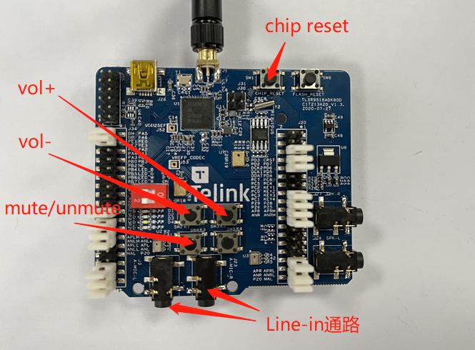

Line-in模式通过板载Line-in通路采集立体声音频数据。

板载4个LED分别为蓝，绿，白，红。

- 蓝灯亮代表Unicast Client连接到了第一个Unicast Server设备。
- 绿灯亮代表Unicast Client连接到了第二个Unicast Server设备。
- 白灯亮说明CIS音频通路已经建立。
- 红灯闪烁代表程序正常执行。

### Unicast Server

Unicast Server使用TLSR9517C EVK。

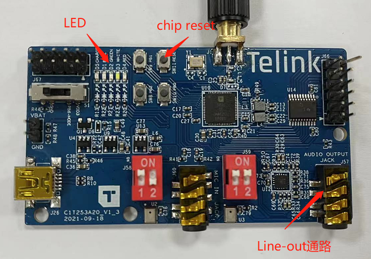

Unicast Server接收到音频数据后，通过板载Line-out通路播放音频数据。

板载4个LED分别为蓝，绿，白，红。

- 红灯亮代表Unicast Server连接到了Unicast Client，红灯灭代表连接中断。
- 白灯亮代表Unicast Server与Unicast Client之间的音频通路建立完成。白灯灭代表音频通路中断。

### USB模式

USB模式的连接如下图：

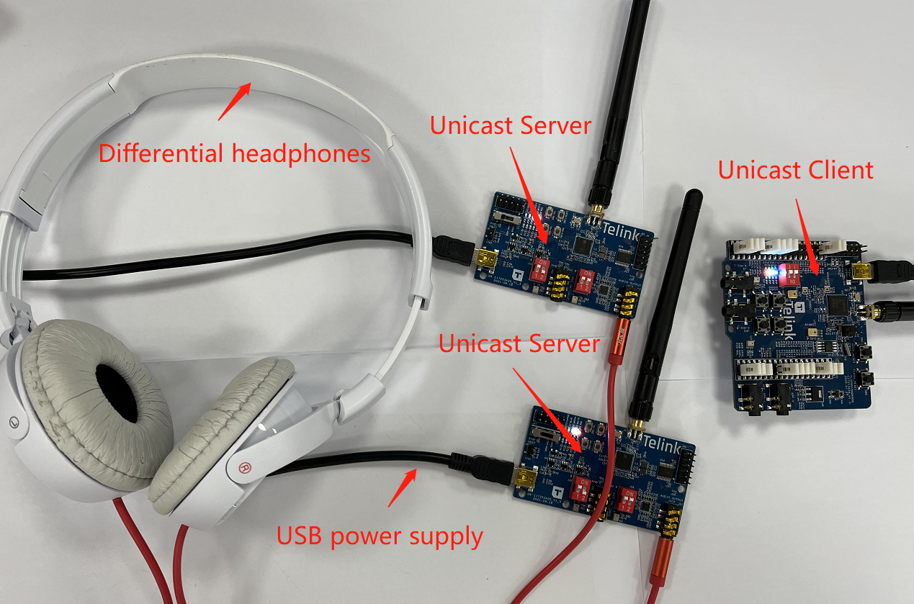

首先保证烧录程序正确,Unicast Client和Unicast Server上电后会自动连接并建立音频通路。通过Unicast Client和Unicast Server端设备的LED判断设备连接以及音频通路建立完成。

Audio Demo的USB模式采用48K，16bit 的播放格式。Unicast Client通过USB数据线与电脑直接相连，无需额外供电，如下图上方。

电脑端会将Unicast Client识别为speaker设备，名称为“Telink LE Audio”，如下图下方。选择该设备作为电脑端的播放器。需注意，在这里调节音量无效。

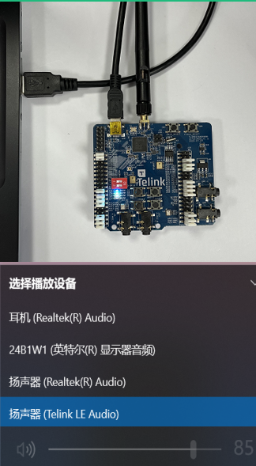

Unicast Client与Unicast Server连接成功，音频通路建立完成,电脑端成功识别Unicast Server为“Telink LE Audio”后，打开电脑端音频播放软件，以网易云音乐为例，如下图。

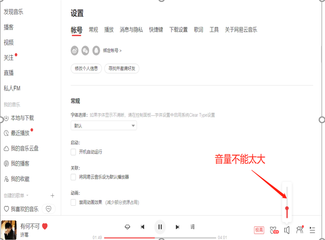

在音乐播放软件中调整音量时，调整的是原始音频数据的音量，无论USB模式还是Line-in模式都是有效的。

USB音频数据采样率固定为48K，无论音频播放软件播放的音频数据采样率位宽为多少，USB都会将其转换为48K，16bit。

### Line-in模式

Line-in模式的连接如下图：

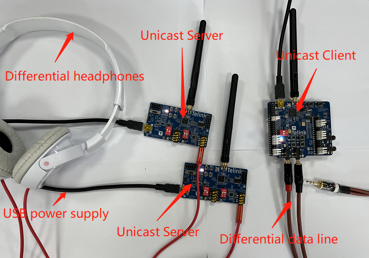

首先保证烧录程序正确,Unicast Client和Unicast Server上电后会自动连接并建立音频通路。通过Unicast Client和Unicast Server端设备的LED判断设备连接以及音频通路建立完成。

Line-in模式采用48K，16bit的播放格式。

将差分数据线的差分两端分别插入Unicast Client的Line-in通路，另一端单端插入手机或电脑，如下图上方。电脑端会将单端音频数据线识别为耳机，在这里可以调整音量。

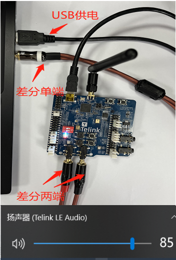

在电脑端或者手机端打开任意音乐软件，开始播放音乐。

### 注意事项

- 无论是USB模式还是Line-in模式，请注意输入音频音量不能太大，输入音频能量超过EVK门限会导致芯片Audio模块重启。
- Demo暂不支持Unicast Server断电回连(后续版本会加上该功能)。如果Unicast Client和Unicast Server连接中断，请首先重启Unicast Client,再重启Unicast Server。
- 音量调节功能共有6个等级，上电默认Unicast Server处于最低音量。当音量处于最低等级或者最高等级时，再调低或调高音量会无效。
- Mute/Unmute按键共享一个按键，每次按键会在mute/unmute之间切换。
- Demo没有对音频性能进行优化(后续版本会加上)。

## Code Size of CIS Demo

-----------------------------------------------------------------------------------
                       CIS-SOURCE/USB       CIS-SOURCE/Line-in       CIS-Sink
---------------------- -------------------- ------------------------ --------------
Flash code size        173k                 189k                     183k

RAM size               75k                  76k                      47k

-----------------------------------------------------------------------------------

Table: Code size of CIS demo

# Auracast™ Audio Demo (BIS Demo)

## Auracast Broadcast Audio

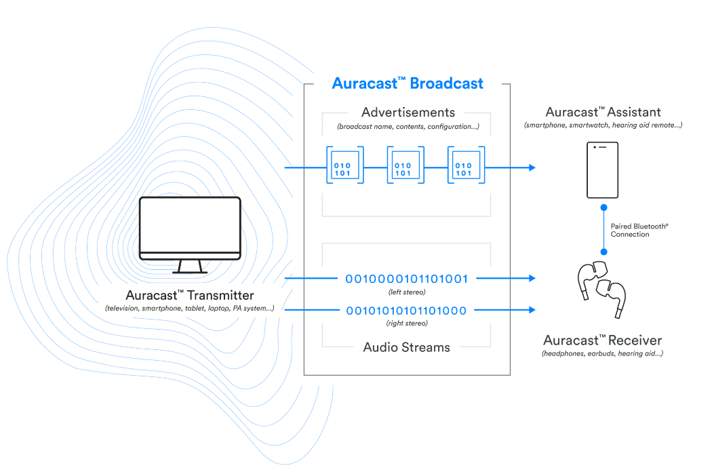

Broadcast source发送广播音频，通知broadcast assistant周边有可用的广播传输。

Broadcast assistant扫描到广播音频，提供UI让用户能够选择想要的广播传输。

Broadcast sink通过接收broadcast assistant的消息，来解析加入哪个广播传输和如何加入该广播传输。

## 功能介绍

### Broadcast Source

TLSR9518A dongle板实现Broadcast Source 角色功能。

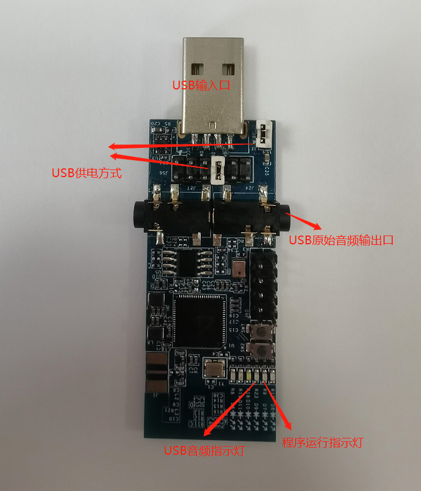

Broadcast Source支持USB模式，USB枚举设备采样率支持48K。Source通过USB插入PC/Phone后，USB枚举名称Telink BIS SOURCE 1，选择想要播放的扬声器，开始播放音乐。Source会将音乐通过广播音频发射到空中。

**主要功能**

- 支持USB音频输入。
- 黄灯闪烁指示正常允许。
- 红灯亮指示USB有音乐播放。
- Line-Out播放USB原始数据。

**操作步骤**

- 正确烧录程序后，直接通过USB与PC/Phone连接。
- PC端识别为Speaker设备，名称为Telink BIS SOURCE 2，选择该设备作为播放端。
- 在电脑端打开播放器，开始播放音乐。正常情况下红灯常亮，Line-Out可以听到正在播放的音乐。音量调节只能在播放器中调节。

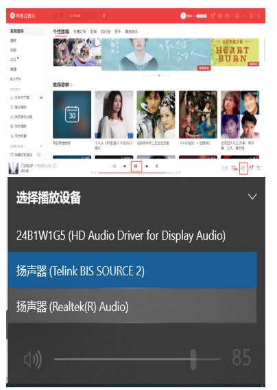

### Broadcast Sink

TLSR9517C EVK实现Broadcast sink角色功能。

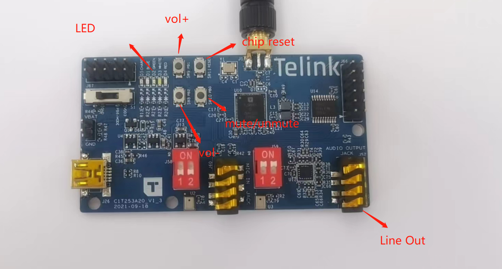

Broadcast sink支持Broadcast assistant连接并配置source信息，与对应的source建立BIS通路，播放音频。支持本地音量调节，mute/unmute；支持Broadcast assistant端远程音量调节，mute/unmute，切换不同Source信息。

**主要功能**

- 黄灯指示供电正常。
- 白灯闪烁指示芯片正常工作。
- 红灯常亮指示有异步连接存在。
- 绿地常亮指示有BIS数据同步。
- 立体声输出。
- 本地音量调节、mute/unmute。

### Broadcast assistant

TLSR9218A RCU实现Broadcast assistant角色功能。

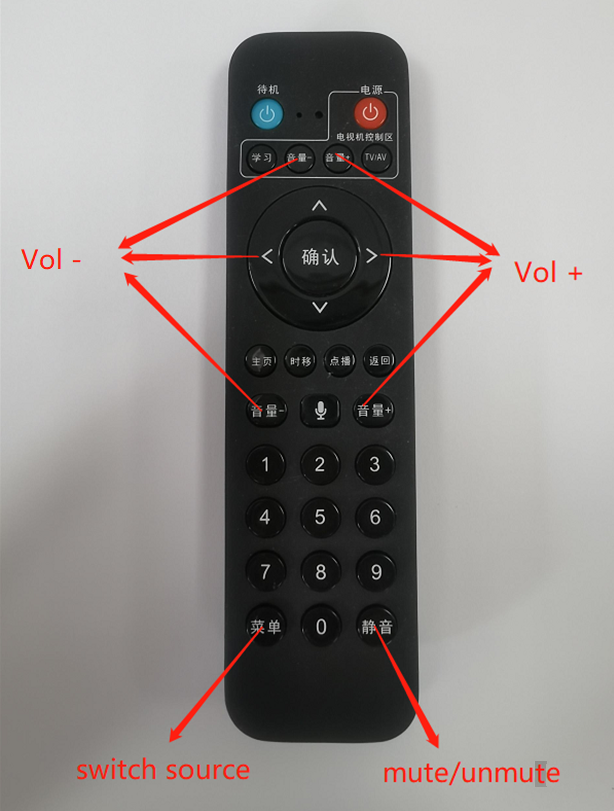

Broadcast assistant支持一路sink端和四路Source同步功能。Broadcast assistant上电默认扫描sink端，并且自动建立异步连接；异步连接成功后，扫描控制可用的source信息。为连接的sink端，切换不同源信息的功能；调节sink端音量，mute/unmute功能。

**主要功能**

- 最多可配置一路sink和四路source信息。
- 能调节sink端音量、mute/unmute。
- 自动重连已经同步过source信息的sink设备。

----------------------------------------
功能                 按键
-------------------- -------------------
音量加               所有音量加

音量减               所有音量减

静音                 静音

切换source信息       菜单

-----------------------------------------

Table: Broadcast assistant功能表

## 测试环境

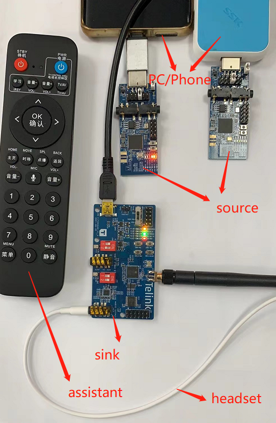

BIS测试环境中，Source端数量最少一个，最多不超过四个。Sink端数量不限，上图中只放了一个Sink端。Assistant的数据需要和Sink端匹配，可以实现音量调节，mute/unmute，切换不同的Source信息。

## 操作步骤

(1) Broadcast source、Broadcast sink、Broadcast assistant通电工作，Source端USB开始音频传输。

(2) 等待assistant端和sink端建立ACL连接（assistant端绿灯闪两下，sink端红灯亮）。

(3) 添加source信息到sink端（菜单按键）。

(4) Sink端完成同步，绿灯亮，音频输出。

(5) 为sink端切换另一个source信息（菜单按键）。

(6) Sink端断开前一个source同步，绿灯灭，停止音频输出；同步新的source，绿灯亮，音频输出。

## Code Size of BIS

---------------------------------------------------------------------------------
                       BIS-SOURCE           BIS Assistant          BIS Sink
---------------------- -------------------- ---------------------- --------------
Flash code size        148k                 180k                   197k

RAM size               94k                  63k                    74k

---------------------------------------------------------------------------------

Table: Code size of BIS
